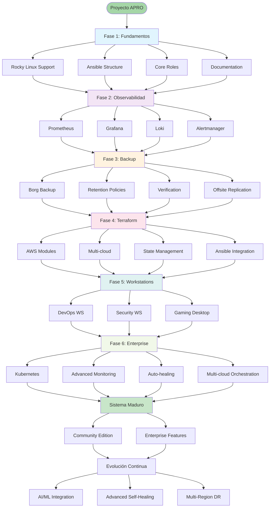

# Diagramas de Actividad - Proyecto APRO

Este documento contiene los diagramas de flujo de actividad para los diferentes procesos del proyecto APRO.

## Tabla de Contenidos

1. [Proceso de Aprovisionamiento de Servidor](#proceso-de-aprovisionamiento-de-servidor)
2. [Proceso de Hardening de Seguridad](#proceso-de-hardening-de-seguridad)
3. [Proceso de Backup y Recovery](#proceso-de-backup-y-recovery)
4. [Proceso de Deployment con CI/CD](#proceso-de-deployment-con-cicd)
5. [Proceso de Configuración de Workstation](#proceso-de-configuración-de-workstation)
6. [Proceso de Monitoreo y Alertas](#proceso-de-monitoreo-y-alertas)

---

## Proceso de Aprovisionamiento de Servidor

```mermaid
flowchart TD
    Start([Inicio: Nuevo Servidor]) --> CheckOS{Verificar<br/>Sistema Operativo}

    CheckOS -->|Debian/Ubuntu| DebianPath[Usar APT]
    CheckOS -->|Rocky/RHEL| RHELPath[Usar DNF/YUM]
    CheckOS -->|Arch| ArchPath[Usar Pacman]
    CheckOS -->|Desconocido| ManualOS[Input Manual]

    ManualOS --> ValidateOS{OS<br/>Válido?}
    ValidateOS -->|No| ManualOS
    ValidateOS -->|Sí| UpdateSystem

    DebianPath --> UpdateSystem[Actualizar Sistema]
    RHELPath --> UpdateSystem
    ArchPath --> UpdateSystem

    UpdateSystem --> InstallBasic[Instalar Paquetes Básicos]
    InstallBasic --> ConfigureNetwork[Configurar Red y DNS]
    ConfigureNetwork --> SetupSSH[Configurar SSH]

    SetupSSH --> GenerateKeys{Claves SSH<br/>Existen?}
    GenerateKeys -->|No| CreateKeys[Generar Claves Ed25519]
    GenerateKeys -->|Sí| UseExisting[Usar Existentes]
    CreateKeys --> AddToGitHub[Agregar a GitHub]
    UseExisting --> AddToGitHub

    AddToGitHub --> ApplyHardening[Aplicar Hardening]

    ApplyHardening --> KernelHarden[Kernel Parameters]
    KernelHarden --> SSHHarden[SSH Hardening]
    SSHHarden --> SetupFirewall[Configurar Firewall]

    SetupFirewall --> DetectFW{Firewall<br/>Disponible?}
    DetectFW -->|UFW| ConfigUFW[Configurar UFW]
    DetectFW -->|Firewalld| ConfigFWD[Configurar Firewalld]
    DetectFW -->|Ninguno| InstallFW[Instalar Firewall]

    ConfigUFW --> EnableFW[Habilitar Firewall]
    ConfigFWD --> EnableFW
    InstallFW --> EnableFW

    EnableFW --> InstallF2B[Instalar Fail2Ban]
    InstallF2B --> ConfigAudit[Configurar Auditd]
    ConfigAudit --> AutoUpdates[Configurar Auto-Updates]

    AutoUpdates --> ProjectSetup{Configurar<br/>Proyecto?}

    ProjectSetup -->|Sí| CloneRepo[Clonar Repositorio]
    ProjectSetup -->|No| FinalReport

    CloneRepo --> DetectProjectType{Tipo de<br/>Proyecto?}
    DetectProjectType -->|Docker| SetupDocker[Setup Docker]
    DetectProjectType -->|LAMP| SetupLAMP[Setup LAMP]
    DetectProjectType -->|Auto-detect| AutoDetect[Detectar Automáticamente]

    AutoDetect --> DetectProjectType

    SetupDocker --> CreateEnvFile[Crear .env]
    CreateEnvFile --> DockerCompose[Docker Compose Up]
    DockerCompose --> ConfigurePorts[Configurar Puertos en FW]

    SetupLAMP --> InstallLAMP[Instalar Apache/MySQL/PHP]
    InstallLAMP --> CopyProject[Copiar Proyecto a /var/www]
    CopyProject --> SetPermissions[Configurar Permisos]

    ConfigurePorts --> FinalReport[Generar Reporte]
    SetPermissions --> FinalReport

    FinalReport --> ShowSummary[Mostrar Resumen]
    ShowSummary --> End([Fin: Servidor Listo])

    style Start fill:#a5d6a7
    style End fill:#81c784
    style ApplyHardening fill:#fff9c4
    style ProjectSetup fill:#ffccbc
```



---

## Proceso de Hardening de Seguridad

```mermaid
flowchart TD
    Start([Inicio: Hardening]) --> Backup[Backup de Configuraciones]

    Backup --> KernelParams[Aplicar Parámetros de Kernel]

    KernelParams --> NetSec[Network Security]
    NetSec --> IPForward[Deshabilitar IP Forwarding]
    IPForward --> SynCookies[Habilitar SYN Cookies]
    SynCookies --> ICMPRedirect[Deshabilitar ICMP Redirects]
    ICMPRedirect --> SourceRoute[Deshabilitar Source Routing]

    SourceRoute --> KernelSec[Kernel Security]
    KernelSec --> Kptr[kptr_restrict = 2]
    Kptr --> Ptrace[ptrace_scope = 1]
    Ptrace --> ASLR[ASLR = 2]

    ASLR --> FSSec[Filesystem Security]
    FSSec --> ProtectSymlinks[Protected Symlinks]
    ProtectSymlinks --> ProtectHardlinks[Protected Hardlinks]
    ProtectHardlinks --> ProtectFIFO[Protected FIFOs]
    ProtectFIFO --> DisableCoreDumps[Disable Core Dumps]

    DisableCoreDumps --> SSHConfig[Configurar SSH]

    SSHConfig --> DisableRootLogin[PermitRootLogin no]
    DisableRootLogin --> DisablePassAuth[PasswordAuthentication no]
    DisablePassAuth --> MaxAuthTries[MaxAuthTries 3]
    MaxAuthTries --> ModernCrypto[Algoritmos Modernos]
    ModernCrypto --> DisableForwarding[Disable Forwarding]

    DisableForwarding --> ValidateSSH{SSH Config<br/>Válida?}
    ValidateSSH -->|No| RestoreSSH[Restaurar Backup]
    ValidateSSH -->|Sí| RestartSSH[Reiniciar SSH]

    RestoreSSH --> SSHConfig
    RestartSSH --> SetupFW[Configurar Firewall]

    SetupFW --> DefaultDeny[Default: Deny Incoming]
    DefaultDeny --> AllowSSH[Allow SSH]
    AllowSSH --> AllowHTTP[Allow HTTP/HTTPS]
    AllowHTTP --> RateLimit[Rate Limiting SSH]

    RateLimit --> F2BSetup[Configurar Fail2Ban]
    F2BSetup --> F2BJails[Jails: SSH, SSH-DDoS]
    F2BJails --> F2BBantime[Bantime: 1-2 horas]
    F2BBantime --> F2BMaxretry[Maxretry: 3]

    F2BMaxretry --> SELinuxCheck{OS con<br/>SELinux?}
    SELinuxCheck -->|Sí| ConfigSELinux[SELinux Enforcing]
    SELinuxCheck -->|No| CheckAppArmor{OS con<br/>AppArmor?}

    ConfigSELinux --> AuditSetup
    CheckAppArmor -->|Sí| ConfigAppArmor[AppArmor Enforcing]
    CheckAppArmor -->|No| AuditSetup
    ConfigAppArmor --> AuditSetup

    AuditSetup[Configurar Auditd] --> AuditRules[Audit Rules]
    AuditRules --> AuditIdentity[Monitor /etc/passwd,shadow,group]
    AuditIdentity --> AuditSudo[Monitor sudo.log]
    AuditSudo --> AuditSSH[Monitor sshd_config]
    AuditSSH --> AuditAuth[Monitor auth.log]

    AuditAuth --> SecureSHM[Secure Shared Memory]
    SecureSHM --> RemoveUnnecessary[Remover Paquetes Innecesarios]
    RemoveUnnecessary --> SystemLimits[Configurar System Limits]

    SystemLimits --> VerifyAll[Verificar Todas las Configuraciones]
    VerifyAll --> RunTests[Ejecutar Tests de Seguridad]

    RunTests --> TestsPassed{Tests<br/>Pasaron?}
    TestsPassed -->|No| ReviewIssues[Revisar Issues]
    TestsPassed -->|Sí| GenerateReport[Generar Reporte de Seguridad]

    ReviewIssues --> FixIssues[Corregir Issues]
    FixIssues --> RunTests

    GenerateReport --> End([Fin: Sistema Hardened])

    style Start fill:#ffcdd2
    style End fill:#c8e6c9
    style ValidateSSH fill:#fff9c4
    style TestsPassed fill:#ffccbc
```



---

## Proceso de Backup y Recovery

```mermaid
flowchart TD
    Start([Inicio: Backup Programado]) --> CheckTime{Es Hora de<br/>Backup?}

    CheckTime -->|No| Wait[Esperar]
    CheckTime -->|Sí| DetermineType{Tipo de<br/>Backup?}

    Wait --> CheckTime

    DetermineType -->|Domingo| FullBackup[Full Backup]
    DetermineType -->|Otro Día| IncrementalBackup[Incremental Backup]
    DetermineType -->|Primer Dom del Mes| MonthlyBackup[Monthly Backup]

    FullBackup --> PrepareData[Preparar Datos]
    IncrementalBackup --> PrepareData
    MonthlyBackup --> PrepareData

    PrepareData --> CheckDatabases{Hay<br/>Databases?}
    CheckDatabases -->|Sí| DumpDBs[Dump Databases]
    CheckDatabases -->|No| CollectFiles

    DumpDBs --> DumpMySQL[mysqldump]
    DumpMySQL --> DumpPostgres[pg_dump]
    DumpPostgres --> CollectFiles[Recopilar Archivos]

    CollectFiles --> AppData[/opt/apps/]
    AppData --> ConfigFiles[/etc/ seleccionados]
    ConfigFiles --> UserData[/home/ opcional]
    UserData --> DockerVolumes[Docker Volumes]

    DockerVolumes --> BorgCreate[borg create]
    BorgCreate --> Dedup[Deduplicación]
    Dedup --> Compress[Compresión zstd]
    Compress --> Encrypt[Cifrado AES-256]

    Encrypt --> CheckLocal{Espacio<br/>Suficiente?}
    CheckLocal -->|No| CleanOld[Limpiar Backups Antiguos]
    CheckLocal -->|Sí| WriteLocal[Escribir a Repo Local]

    CleanOld --> ApplyRetention[Aplicar Políticas de Retención]
    ApplyRetention --> WriteLocal

    WriteLocal --> VerifyIntegrity[Verificar Integridad]
    VerifyIntegrity --> IntegrityOK{Integridad<br/>OK?}

    IntegrityOK -->|No| AlertFailure[Alerta: Backup Fallido]
    IntegrityOK -->|Sí| SyncOffsite{Replicar<br/>Offsite?}

    AlertFailure --> LogError[Log Error]
    LogError --> NotifyAdmin[Notificar Admin]
    NotifyAdmin --> End

    SyncOffsite -->|Sí| UploadS3[Upload a S3]
    SyncOffsite -->|No| UpdateMetrics

    UploadS3 --> CheckUpload{Upload<br/>Exitoso?}
    CheckUpload -->|No| RetryUpload{Reintentar?}
    CheckUpload -->|Sí| VerifyRemote[Verificar Remoto]

    RetryUpload -->|Sí| UploadS3
    RetryUpload -->|No| AlertOffsite[Alerta: Offsite Falló]
    AlertOffsite --> UpdateMetrics

    VerifyRemote --> UpdateMetrics[Actualizar Métricas]
    UpdateMetrics --> LogSuccess[Log Success]
    LogSuccess --> Prune[Prune Old Backups]
    Prune --> End([Fin: Backup Completado])

    subgraph "Proceso de Recovery"
        RecoveryStart([Inicio: Recovery Request]) --> SelectBackup[Seleccionar Backup]
        SelectBackup --> SelectSource{Fuente?}

        SelectSource -->|Local| FetchLocal[Fetch Local Repo]
        SelectSource -->|Offsite| DownloadS3[Download from S3]

        FetchLocal --> ListArchives[Listar Archives]
        DownloadS3 --> ListArchives

        ListArchives --> ChooseArchive[Elegir Archive]
        ChooseArchive --> ExtractData[borg extract]
        ExtractData --> Decrypt[Descifrar]
        Decrypt --> Decompress[Descomprimir]
        Decompress --> RestoreFiles[Restaurar Archivos]

        RestoreFiles --> RestoreType{Tipo de<br/>Restore?}
        RestoreType -->|Archivo Específico| RestoreSingle[Restore Single File]
        RestoreType -->|Directorio| RestoreDir[Restore Directory]
        RestoreType -->|Full System| RestoreFull[Full System Restore]

        RestoreSingle --> VerifyRestore
        RestoreDir --> VerifyRestore
        RestoreFull --> RestoreDB[Restore Databases]

        RestoreDB --> VerifyRestore[Verificar Restore]
        VerifyRestore --> RestoreOK{Restore<br/>Exitoso?}

        RestoreOK -->|No| LogRecoveryError[Log Error]
        RestoreOK -->|Sí| RecoveryReport[Reporte de Recovery]

        LogRecoveryError --> RecoveryEnd
        RecoveryReport --> RecoveryEnd([Fin: Recovery Completado])
    end

    style Start fill:#e3f2fd
    style End fill:#c8e6c9
    style RecoveryStart fill:#fff9c4
    style RecoveryEnd fill:#81c784
    style AlertFailure fill:#ffcdd2
```

---

## Proceso de Deployment con CI/CD

```mermaid
flowchart TD
    Start([Desarrollador: git push]) --> TriggerCI[Trigger CI Pipeline]

    TriggerCI --> Checkout[Checkout Code]
    Checkout --> InstallDeps[Install Dependencies]
    InstallDeps --> Lint[Lint Code]

    Lint --> LintPass{Lint<br/>Passed?}
    LintPass -->|No| NotifyDev[Notificar Desarrollador]
    LintPass -->|Sí| UnitTests[Unit Tests]

    NotifyDev --> EndFail([Fin: Pipeline Failed])

    UnitTests --> TestsPass{Tests<br/>Passed?}
    TestsPass -->|No| GenerateReport[Generar Reporte de Tests]
    TestsPass -->|Sí| SecurityScan[Security Scan]

    GenerateReport --> NotifyDev

    SecurityScan --> ScanCode[Scan Code - Trivy]
    ScanCode --> ScanDeps[Scan Dependencies]
    ScanDeps --> ScanSecrets[Scan Secrets - Gitleaks]
    ScanSecrets --> ScanIaC[Scan IaC - tfsec]

    ScanIaC --> VulnFound{Vulnerabilidades<br/>Críticas?}
    VulnFound -->|Sí| BlockDeploy[Bloquear Deploy]
    VulnFound -->|No| BuildImage[Build Container Image]

    BlockDeploy --> SecurityReport[Reporte de Seguridad]
    SecurityReport --> NotifyDev

    BuildImage --> OptimizeImage[Optimize Image]
    OptimizeImage --> TagImage[Tag Image]
    TagImage --> PushRegistry[Push to Registry]

    PushRegistry --> CheckEnvironment{Environment?}

    CheckEnvironment -->|Dev| DeployDev[Deploy to Dev]
    CheckEnvironment -->|Staging| RequireApproval{Aprobación<br/>Manual?}
    CheckEnvironment -->|Production| RequireProdApproval{Aprobación<br/>Manual + Tests?}

    RequireApproval -->|Aprobado| DeployStaging[Deploy to Staging]
    RequireApproval -->|Rechazado| EndFail

    RequireProdApproval -->|Aprobado| SmokeTestsStaging[Smoke Tests en Staging]
    RequireProdApproval -->|Rechazado| EndFail

    SmokeTestsStaging --> StagingOK{Staging<br/>OK?}
    StagingOK -->|No| RollbackStaging[Rollback Staging]
    StagingOK -->|Sí| DeployProd[Deploy to Production]

    RollbackStaging --> NotifyDev

    DeployDev --> AnsibleDeploy[Ansible Playbook]
    DeployStaging --> AnsibleDeploy
    DeployProd --> AnsibleDeploy

    AnsibleDeploy --> GetSecrets[Obtener Secretos de Vault]
    GetSecrets --> UpdateConfig[Update Configuration]
    UpdateConfig --> RollingUpdate[Rolling Update]

    RollingUpdate --> UpdateNode1[Update Node 1]
    UpdateNode1 --> HealthCheck1{Health<br/>Check?}

    HealthCheck1 -->|Fail| RollbackNode[Rollback Node]
    HealthCheck1 -->|Pass| UpdateNode2[Update Node 2]

    RollbackNode --> AlertOps[Alert Ops Team]
    AlertOps --> EndFail

    UpdateNode2 --> HealthCheck2{Health<br/>Check?}
    HealthCheck2 -->|Fail| RollbackAll[Rollback All]
    HealthCheck2 -->|Pass| UpdateNodeN[Update Node N]

    RollbackAll --> AlertOps

    UpdateNodeN --> FinalHealthCheck[Final Health Check]
    FinalHealthCheck --> IntegrationTests[Integration Tests]

    IntegrationTests --> AllTestsPass{All Tests<br/>Pass?}
    AllTestsPass -->|No| AutoRollback[Auto-Rollback]
    AllTestsPass -->|Sí| UpdateMonitoring[Update Monitoring]

    AutoRollback --> RollbackComplete[Rollback Completado]
    RollbackComplete --> PostMortem[Generar Post-Mortem]
    PostMortem --> NotifyDev

    UpdateMonitoring --> UpdatePrometheus[Update Prometheus Targets]
    UpdatePrometheus --> UpdateGrafana[Update Grafana]
    UpdateGrafana --> SetupAlerts[Setup Alerts]

    SetupAlerts --> RunSmokeTests[Run Smoke Tests]
    RunSmokeTests --> SmokePass{Smoke Tests<br/>Pass?}

    SmokePass -->|No| AutoRollback
    SmokePass -->|Sí| TagRelease[Tag Release]

    TagRelease --> NotifySuccess[Notificar Éxito]
    NotifySuccess --> UpdateDocs[Update Docs]
    UpdateDocs --> EndSuccess([Fin: Deployment Exitoso])

    style Start fill:#a5d6a7
    style EndSuccess fill:#81c784
    style EndFail fill:#ef5350
    style VulnFound fill:#ffccbc
    style AllTestsPass fill:#fff9c4
```



---

## Proceso de Configuración de Workstation

```mermaid
flowchart TD
    Start([Inicio: Nueva Workstation]) --> SelectType{Tipo de<br/>Workstation?}

    SelectType -->|DevOps| DevOpsSetup
    SelectType -->|Security| SecuritySetup
    SelectType -->|Gaming| GamingSetup

    subgraph "DevOps Workstation"
        DevOpsSetup[Setup DevOps] --> InstallArch[Instalar Arch Linux]
        InstallArch --> SelectDE{Desktop<br/>Environment?}

        SelectDE -->|GNOME| InstallGNOME[Install GNOME]
        SelectDE -->|KDE| InstallKDE[Install KDE Plasma]
        SelectDE -->|i3| Installi3[Install i3wm]

        InstallGNOME --> DevTools
        InstallKDE --> DevTools
        Installi3 --> DevTools

        DevTools[Instalar Dev Tools] --> InstallDocker[Docker + Compose]
        InstallDocker --> InstallK8s[kubectl + k9s + helm]
        InstallK8s --> InstallIaC[Terraform + Ansible + Packer]
        InstallIaC --> InstallIDEs[VSCode + JetBrains]
        InstallIDEs --> InstallCLIs[Cloud CLIs - AWS/GCP/Azure]
        InstallCLIs --> TerminalTools[Terminal Tools]

        TerminalTools --> InstallZsh[zsh + oh-my-zsh]
        InstallZsh --> InstallTmux[tmux]
        InstallTmux --> InstallFzf[fzf + ripgrep + bat]
        InstallFzf --> DevDotfiles[Configurar Dotfiles]
    end

    subgraph "Security Workstation"
        SecuritySetup[Setup Security] --> InstallBase[Arch + Kali Repos]
        InstallBase --> InstallSecDE[GNOME/Xfce]
        InstallSecDE --> WebTools[Web App Tools]

        WebTools --> InstallBurp[Burp Suite Pro]
        InstallBurp --> InstallZAP[OWASP ZAP]
        InstallZAP --> InstallSQLMap[SQLMap + Nikto]
        InstallSQLMap --> NetworkTools[Network Tools]

        NetworkTools --> InstallNmap[Nmap + Masscan]
        InstallNmap --> InstallWireshark[Wireshark]
        InstallWireshark --> ExploitTools[Exploitation Tools]

        ExploitTools --> InstallMSF[Metasploit]
        InstallMSF --> InstallEmpire[Empire/Covenant]
        InstallEmpire --> ReverseTools[Reverse Engineering]

        ReverseTools --> InstallGhidra[Ghidra]
        InstallGhidra --> Installr2[radare2]
        Installr2 --> PasswordTools[Password Tools]

        PasswordTools --> InstallHashcat[Hashcat]
        InstallHashcat --> InstallJohn[John the Ripper]
        InstallJohn --> VMLab[Setup VM Lab]

        VMLab --> InstallVBox[VirtualBox + Vagrant]
        InstallVBox --> DownloadVMs[Download Lab VMs]
        DownloadVMs --> SecDotfiles[Configurar Dotfiles]
    end

    subgraph "Gaming Workstation"
        GamingSetup[Setup Gaming] --> SelectGamingBase{Base<br/>System?}

        SelectGamingBase -->|SteamOS| InstallSteamOS[Install SteamOS]
        SelectGamingBase -->|ChimeraOS| InstallChimera[Install ChimeraOS]
        SelectGamingBase -->|Arch Custom| InstallArchGaming[Arch + Zen Kernel]

        InstallSteamOS --> InstallKDEGaming
        InstallChimera --> InstallKDEGaming
        InstallArchGaming --> InstallKDEGaming[Install KDE Plasma]

        InstallKDEGaming --> SetupDrivers{GPU<br/>Type?}

        SetupDrivers -->|AMD| InstallMesa[Mesa + Vulkan]
        SetupDrivers -->|NVIDIA| InstallNVIDIA[NVIDIA Proprietary]
        SetupDrivers -->|Intel| InstallIntel[Intel + Vulkan]

        InstallMesa --> GamingApps
        InstallNVIDIA --> GamingApps
        InstallIntel --> GamingApps

        GamingApps[Gaming Applications] --> InstallSteam[Steam]
        InstallSteam --> InstallProton[Proton-GE]
        InstallProton --> InstallLutris[Lutris + Wine]
        InstallLutris --> InstallHeroic[Heroic Launcher]
        InstallHeroic --> InstallGameMode[GameMode + MangoHud]
        InstallGameMode --> InstallStreaming[Moonlight/Sunshine]
        InstallStreaming --> PerformanceTuning[Performance Tuning]

        PerformanceTuning --> CPUGovernor[CPU Governor: Performance]
        CPUGovernor --> IOScheduler[I/O Scheduler: mq-deadline]
        IOScheduler --> DisableMitigations[Disable Mitigations - Opcional]
        DisableMitigations --> OptimizeGraphics[Optimize Graphics]
        OptimizeGraphics --> GamingDotfiles[Configurar Dotfiles]
    end

    DevDotfiles --> FinalConfig[Configuración Final]
    SecDotfiles --> FinalConfig
    GamingDotfiles --> FinalConfig

    FinalConfig --> SetupBackup[Setup Backup Local]
    SetupBackup --> ConfigureFirewall[Configurar Firewall]
    ConfigureFirewall --> TestConfig[Test Configuración]

    TestConfig --> AllWorking{Todo<br/>Funciona?}
    AllWorking -->|No| TroubleshootResolve[Troubleshoot]
    AllWorking -->|Sí| CreateSnapshot[Crear Snapshot]

    Troubleshoot --> FixIssues[Corregir Issues]
    FixIssues --> TestConfig

    CreateSnapshot --> Documentation[Documentar Configuración]
    Documentation --> End([Fin: Workstation Lista])

    style Start fill:#e1f5fe
    style End fill:#c8e6c9
    style SelectType fill:#fff9c4
    style AllWorking fill:#ffccbc
```



---

## Proceso de Monitoreo y Alertas

```mermaid
flowchart TD
    Start([Sistema en Producción]) --> CollectMetrics[Recopilar Métricas]

    CollectMetrics --> NodeExporter[Node Exporter<br/>Host Metrics]
    NodeExporter --> CAdvisor[cAdvisor<br/>Container Metrics]
    CAdvisor --> BlackboxExporter[Blackbox Exporter<br/>Probes]
    BlackboxExporter --> AppMetrics[Application Metrics]

    AppMetrics --> Prometheus[Prometheus<br/>Time Series DB]

    Prometheus --> StoreMetrics[Almacenar Métricas]
    StoreMetrics --> EvaluateRules[Evaluar Alerting Rules]

    EvaluateRules --> CheckCPU{CPU > 80%<br/>por 5 min?}
    CheckCPU -->|Sí| TriggerCPUAlert[Trigger: High CPU Alert]
    CheckCPU -->|No| CheckMemory

    TriggerCPUAlert --> SendToAM

    CheckMemory{Memory > 90%?} -->|Sí| TriggerMemAlert[Trigger: High Memory Alert]
    CheckMemory -->|No| CheckDisk

    TriggerMemAlert --> SendToAM

    CheckDisk{Disk > 85%?} -->|Sí| TriggerDiskAlert[Trigger: Disk Space Alert]
    CheckDisk -->|No| CheckService

    TriggerDiskAlert --> SendToAM

    CheckService{Service<br/>Down?} -->|Sí| TriggerServiceAlert[Trigger: Service Down - CRITICAL]
    CheckService -->|No| CheckBackup

    TriggerServiceAlert --> SendToAM

    CheckBackup{Backup<br/>Failed?} -->|Sí| TriggerBackupAlert[Trigger: Backup Failed Alert]
    CheckBackup -->|No| CheckSSL

    TriggerBackupAlert --> SendToAM

    CheckSSL{SSL Cert<br/>Expiring?} -->|< 30 días| TriggerSSLAlert[Trigger: SSL Expiring Alert]
    CheckSSL -->|No| ContinueMonitoring

    TriggerSSLAlert --> SendToAM[Send to Alertmanager]

    SendToAM --> GroupAlerts[Agrupar Alertas]
    GroupAlerts --> DetermineSeverity{Severidad?}

    DetermineSeverity -->|Critical| ImmediateAction
    DetermineSeverity -->|Warning| ScheduledNotify
    DetermineSeverity -->|Info| LogOnly

    ImmediateAction[Acción Inmediata] --> PagerDuty[PagerDuty]
    PagerDuty --> SlackCritical[Slack - #incidents]
    SlackCritical --> EmailOps[Email Ops]
    EmailOps --> CheckAutoHealing{Auto-healing<br/>Posible?}

    CheckAutoHealing -->|Sí| TriggerAutoHeal[Trigger Auto-Healing]
    CheckAutoHealing -->|No| WaitManual[Esperar Intervención Manual]

    TriggerAutoHeal --> RestartService{Tipo de<br/>Acción?}
    RestartService -->|Restart Service| ExecuteRestart[systemctl restart]
    RestartService -->|Scale Up| ExecuteScale[Auto-Scale]
    RestartService -->|Failover| ExecuteFailover[Failover to Standby]

    ExecuteRestart --> VerifyFix
    ExecuteScale --> VerifyFix
    ExecuteFailover --> VerifyFix

    VerifyFix[Verificar Solución] --> FixWorked{Problema<br/>Resuelto?}
    FixWorked -->|Sí| ResolveAlert[Resolver Alerta]
    FixWorked -->|No| EscalateManual[Escalate to Manual]

    EscalateManual --> WaitManual

    WaitManual --> ManualFixed{Manual<br/>Fix?}
    ManualFixed -->|Sí| ResolveAlert
    ManualFixed -->|No| CreateIncident[Crear Incident Report]

    CreateIncident --> PostMortem[Schedule Post-Mortem]
    PostMortem --> ResolveAlert

    ResolveAlert --> UpdateMetrics[Actualizar Métricas de Incidente]
    UpdateMetrics --> LogResolution[Log Resolution Time]
    LogResolution --> UpdateDashboard[Update Dashboard]

    ScheduledNotify[Notificación Programada] --> SlackWarning[Slack - #monitoring]
    SlackWarning --> EmailWarning[Email - Team]
    EmailWarning --> UpdateDashboard

    LogOnly[Solo Logging] --> WriteLog[Escribir a Logs]
    WriteLog --> UpdateDashboard

    UpdateDashboard --> Grafana[Grafana Dashboard]
    Grafana --> DisplayMetrics[Display Métricas]
    DisplayMetrics --> DisplayAlerts[Display Alertas Activas]
    DisplayAlerts --> DisplayHistory[Display Histórico]

    DisplayHistory --> ContinueMonitoring[Continuar Monitoreo]
    ContinueMonitoring --> CollectMetrics

    subgraph "Log Aggregation"
        CollectLogs[Recopilar Logs] --> Promtail[Promtail]
        Promtail --> Loki[Loki]
        Loki --> StoreLogs[Almacenar Logs]
        StoreLogs --> QueryLogs[Query Engine]
        QueryLogs --> GrafanaLogs[Grafana - Logs Panel]
        GrafanaLogs --> CorrelateMetrics[Correlacionar con Métricas]
        CorrelateMetrics --> EnhancedVis[Enhanced Visibility]
    end

    DisplayHistory -.Logs.-> CollectLogs

    style Start fill:#e3f2fd
    style TriggerServiceAlert fill:#ffcdd2
    style FixWorked fill:#fff9c4
    style ResolveAlert fill:#c8e6c9
```



---

## Diagrama de Flujo General del Proyecto



---

**Versión**: 1.0.0
**Última Actualización**: 2025-01-15
**Autor**: Juan Damian Pajares
