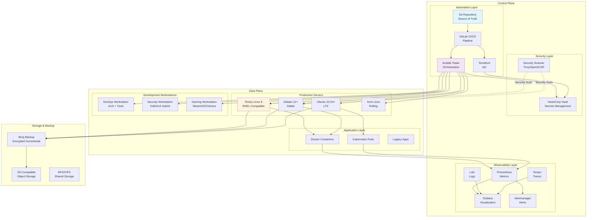
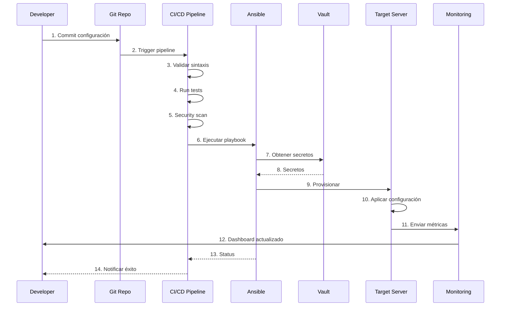
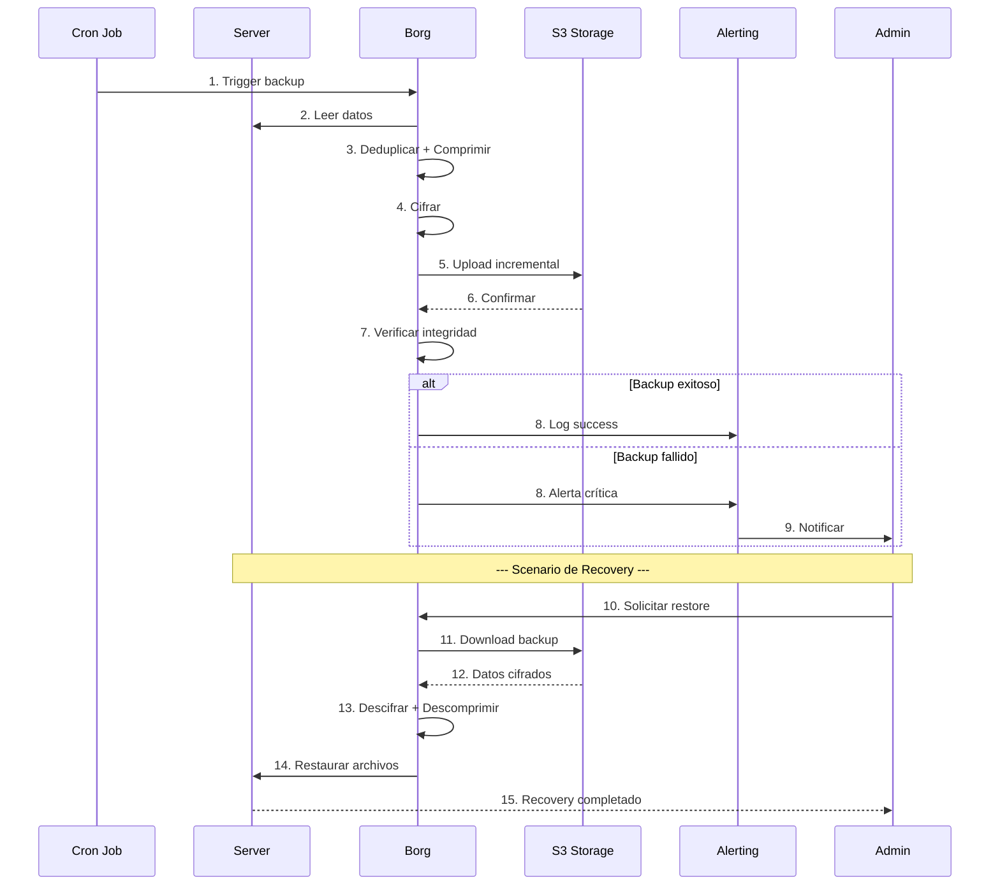
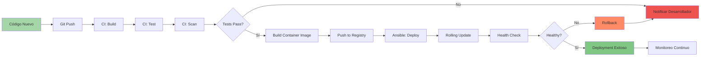
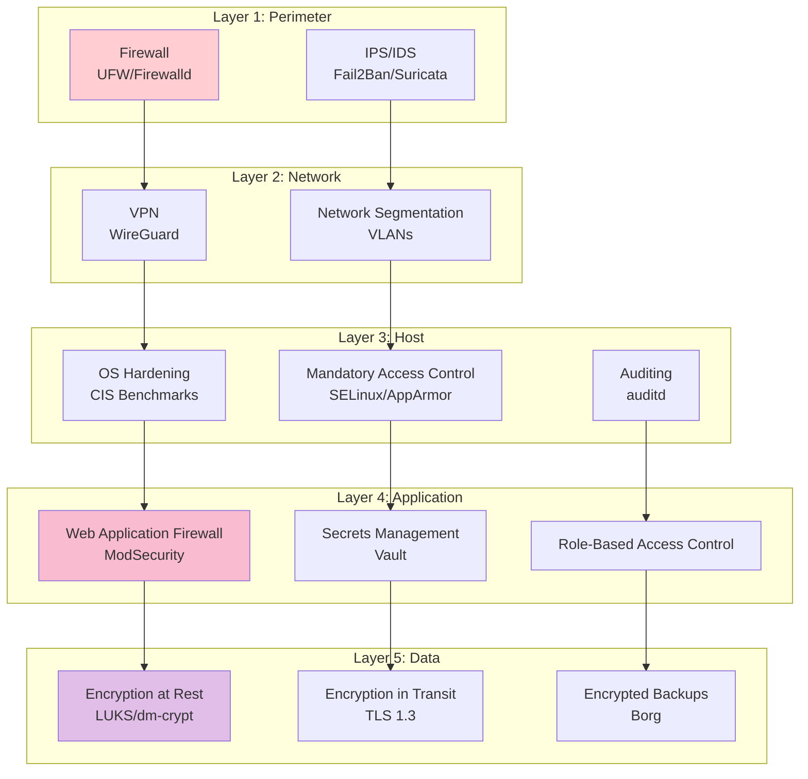
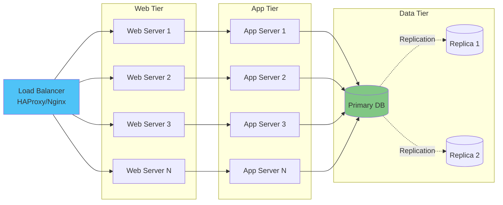
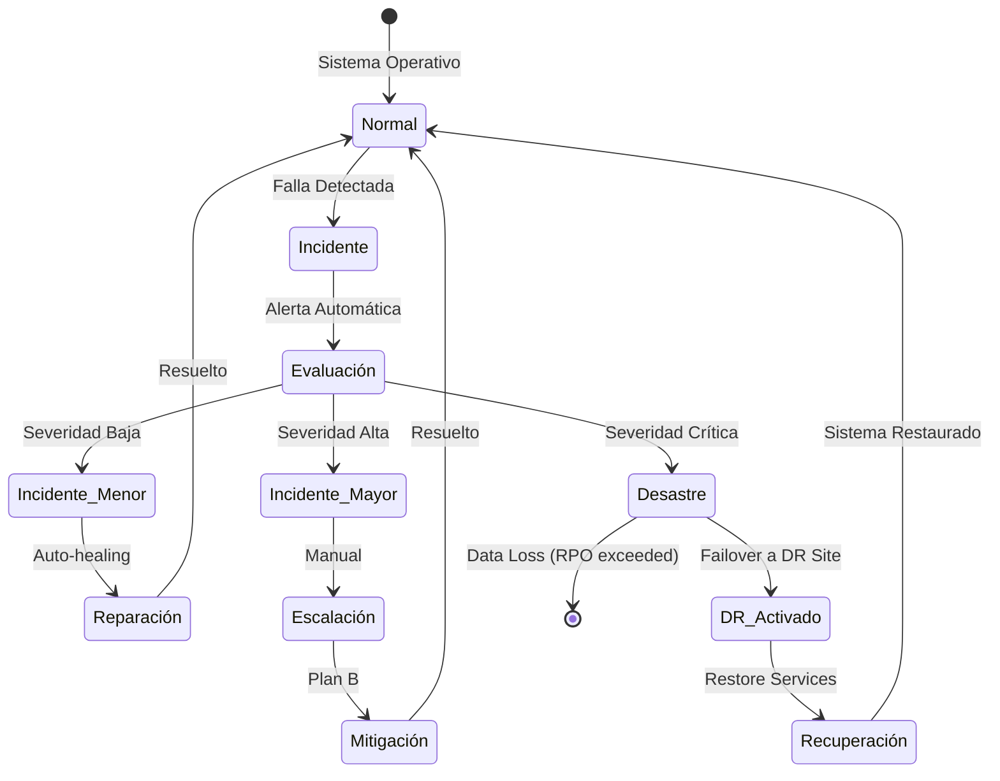
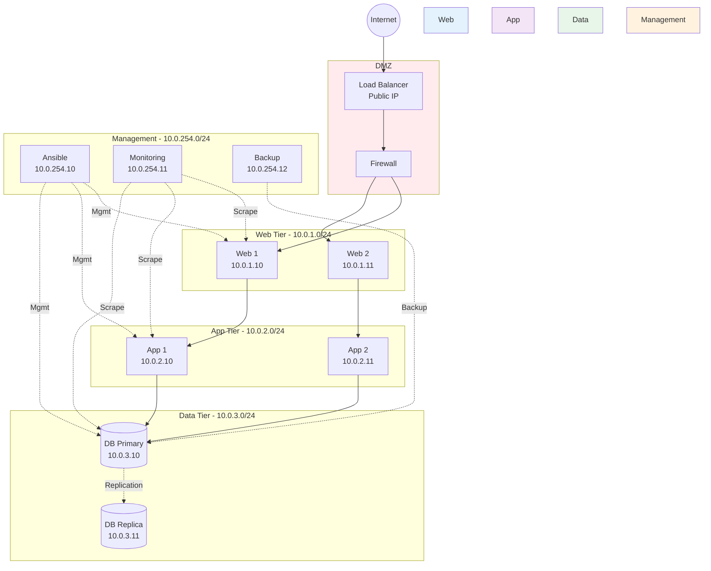

# Arquitectura del Sistema APRO

## Tabla de Contenidos

1. [Visión General](#visión-general)
2. [Diagrama de Arquitectura Global](#diagrama-de-arquitectura-global)
3. [Componentes Principales](#componentes-principales)
4. [Flujos de Trabajo](#flujos-de-trabajo)
5. [Seguridad y Compliance](#seguridad-y-compliance)
6. [Escalabilidad](#escalabilidad)
7. [Disaster Recovery](#disaster-recovery)

## Visión General

APRO es un sistema de aprovisionamiento y orquestación multi-capa diseñado para gestionar infraestructura heterogénea desde servidores de producción hasta estaciones de trabajo especializadas.

### Principios Arquitectónicos

1. **Separación de Concerns**: Control plane separado del data plane
2. **Infrastructure as Code**: Todo versionado y reproducible
3. **Defense in Depth**: Múltiples capas de seguridad
4. **Observability First**: Logs, métricas y trazas desde el diseño
5. **Fail-Safe**: Degradación elegante ante fallas

## Diagrama de Arquitectura Global



## Componentes Principales

### 1. Control Plane

#### 1.1 Automation Layer

**Git Repository**
- **Propósito**: Single source of truth para toda la configuración
- **Tecnología**: Git (GitHub/GitLab)
- **Contenido**:
  - Playbooks Ansible
  - Módulos Terraform
  - Scripts de provisión
  - Configuraciones
  - Documentación

**CI/CD Pipeline**
- **Propósito**: Automatizar testing, validation y deployment
- **Tecnología**: GitLab CI / GitHub Actions
- **Fases**:
  1. Lint y validación de sintaxis
  2. Tests de infraestructura (Molecule, Terratest)
  3. Security scanning
  4. Deployment automático
  5. Smoke tests post-deployment

**Ansible Tower/AWX**
- **Propósito**: Orquestación centralizada de configuración
- **Características**:
  - Inventario dinámico
  - Job scheduling
  - RBAC (Role-Based Access Control)
  - Audit logging
  - Credential management

**Terraform**
- **Propósito**: Provisión de infraestructura cloud
- **Alcance**:
  - VMs en cloud providers
  - Networking (VPC, subnets, security groups)
  - Storage (S3, EBS, etc)
  - Load balancers
  - DNS records

#### 1.2 Security Layer

**HashiCorp Vault**
- **Propósito**: Gestión centralizada de secretos
- **Capacidades**:
  - Dynamic secrets
  - Encryption as a service
  - PKI management
  - Secret rotation
  - Audit logging

**Security Scanners**
- **Trivy**: Vulnerabilidades en contenedores e IaC
- **OpenSCAP**: Compliance scanning (CIS, STIG)
- **Lynis**: Auditoría de sistemas Linux

#### 1.3 Observability Layer

**Prometheus**
- **Métricas**: CPU, RAM, disco, red, application metrics
- **Exporters**:
  - Node Exporter (métricas de host)
  - cAdvisor (métricas de contenedores)
  - Blackbox Exporter (probes)
  - Custom exporters

**Grafana**
- **Dashboards**:
  - Overview de infraestructura
  - Por servidor/servicio
  - Application performance
  - Security metrics
  - Business metrics

**Loki**
- **Logs centralizados**:
  - Syslog
  - Application logs
  - Audit logs
  - Container logs
- **Integración con Grafana para correlación**

**Alertmanager**
- **Alertas inteligentes**:
  - Agrupación de alertas
  - Silencing
  - Routing a múltiples receivers (email, Slack, PagerDuty)
  - Escalation policies

### 2. Data Plane

#### 2.1 Production Servers

**Rocky Linux 9**
- **Casos de uso**: Servidores enterprise que requieren RHEL compatibility
- **Características**:
  - Long-term support (10 años)
  - SELinux enforcing
  - Compatible con Red Hat ecosystem
  - Ideal para cargas críticas

**Debian 12+**
- **Casos de uso**: Servidores estables de propósito general
- **Características**:
  - Extremadamente estable
  - Gran repositorio de paquetes
  - Política de seguridad sólida
  - Bajo footprint

**Ubuntu 22.04 LTS+**
- **Casos de uso**: Servidores con necesidad de software reciente
- **Características**:
  - LTS support de 5 años
  - Hardware moderno bien soportado
  - Snaps para software adicional
  - Cloud-native features

**Arch Linux**
- **Casos de uso**: Laboratorios, desarrollo, testing
- **Características**:
  - Rolling release
  - Bleeding edge packages
  - AUR (Arch User Repository)
  - Máxima flexibilidad

#### 2.2 Development Workstations

**DevOps Workstation**
```
Base: Arch Linux
Desktop: GNOME/KDE/i3wm
Tools:
  - Docker + Docker Compose + Kubernetes
  - Terraform + Ansible + Packer
  - VSCode + JetBrains IDEs
  - Git + GitHub CLI
  - Terminal tools (tmux, zsh, fzf, ripgrep)
  - Cloud CLIs (aws, gcloud, az)
```

**Security Workstation**
```
Base: Arch Linux + Kali repos
Desktop: GNOME/Xfce
Tools:
  - Burp Suite Professional
  - Metasploit Framework
  - Nmap + Wireshark
  - SQLMap, Nikto, etc
  - Reverse engineering (Ghidra, radare2)
  - VM management (Vagrant, VirtualBox)
  - Report tools (CherryTree, Obsidian)
```

**Gaming Workstation**
```
Base: SteamOS/ChimeraOS (Arch-based)
Desktop: Gaming mode + Desktop mode (KDE)
Features:
  - Steam + Proton
  - Lutris + Wine
  - Epic Games (via Heroic)
  - Performance optimization
  - RGB control
  - Game streaming (Moonlight)
```

### 3. Storage & Backup

**Borg Backup**
- **Características**:
  - Deduplicación
  - Compresión
  - Cifrado
  - Verificación de integridad
- **Políticas**:
  - Diario: 7 días
  - Semanal: 4 semanas
  - Mensual: 6 meses
  - Anual: 2 años

**S3-Compatible Storage**
- **Providers**: AWS S3, MinIO, Backblaze B2
- **Uso**:
  - Terraform state
  - Borg repositories
  - Artifacts de CI/CD
  - Backups offsite

## Flujos de Trabajo

### Workflow 1: Provisión de Nuevo Servidor



### Workflow 2: Backup y Recovery



### Workflow 3: Deployment de Aplicación



## Seguridad y Compliance

### Modelo de Seguridad en Capas



### Compliance

#### CIS Benchmarks

Aplicamos los siguientes benchmarks de CIS:
- CIS Debian Linux 12 Benchmark (Level 1 Server)
- CIS Ubuntu Linux 22.04 LTS Benchmark (Level 1 Server)
- CIS Red Hat Enterprise Linux 9 Benchmark (Level 1 Server)
- CIS Docker Benchmark
- CIS Kubernetes Benchmark

#### Auditoría

```yaml
Audit Points:
  - User authentication events
  - Privileged command execution
  - File access (sensitive files)
  - Network connections
  - System calls (suspicious activity)
  - Configuration changes
  - Service start/stop

Retention:
  - Local: 30 días
  - Centralizado: 1 año
  - Archive: 7 años
```

## Escalabilidad

### Horizontal Scaling



### Auto-Scaling (Cloud)

```yaml
Auto-Scaling Policy:
  Metric: CPU Utilization
  Target: 70%

  Scale Up:
    - Threshold: > 80% por 5 minutos
    - Action: Add 1 instance
    - Cooldown: 300 segundos

  Scale Down:
    - Threshold: < 30% por 10 minutos
    - Action: Remove 1 instance
    - Cooldown: 600 segundos

  Limits:
    - Min instances: 2
    - Max instances: 10
```

## Disaster Recovery

### RTO y RPO Targets

| Tier | Criticidad | RTO | RPO | Estrategia |
|------|------------|-----|-----|------------|
| 1 | Crítico | 15 min | 5 min | Hot standby + replicación síncrona |
| 2 | Importante | 1 hora | 15 min | Warm standby + replicación asíncrona |
| 3 | Normal | 4 horas | 1 hora | Cold standby + backups frecuentes |
| 4 | Bajo | 24 horas | 24 horas | Restore desde backup |

### Plan de Disaster Recovery



### Backup Strategy

```yaml
Backup Tiers:

  Application Data:
    Type: Full + Incremental
    Schedule:
      - Full: Semanal (Domingo 2 AM)
      - Incremental: Diario (2 AM)
    Retention: 30 días local, 1 año offsite
    Encryption: AES-256
    Compression: zstd

  Databases:
    Type: Continuous + Point-in-Time
    Schedule:
      - WAL Archive: Cada 5 minutos
      - Full Backup: Diario (3 AM)
    Retention: 7 días PITR, 30 días full
    Encryption: AES-256

  System Configuration:
    Type: Git + Borg
    Schedule:
      - Git: On change
      - Borg: Diario (1 AM)
    Retention: Indefinido (Git), 90 días (Borg)

  Disaster Recovery:
    Type: Full System Image
    Schedule: Semanal (Sábado 11 PM)
    Retention: 4 imágenes (1 mes)
    Storage: Offsite S3
```

## Tecnologías y Versiones

| Componente | Tecnología | Versión | Notas |
|------------|-----------|---------|-------|
| OS Server | Rocky Linux | 9.x | Primary |
| OS Server | Debian | 12+ | Secondary |
| OS Desktop | Arch Linux | Rolling | Dev/Security |
| Orchestration | Ansible | 2.15+ | Con AWX |
| IaC | Terraform | 1.6+ | Multi-cloud |
| Containers | Docker | 24.x+ | Con Compose |
| Orchestration | Kubernetes | 1.28+ | Optional |
| Monitoring | Prometheus | 2.48+ | Metrics |
| Visualization | Grafana | 10.x+ | Dashboards |
| Logging | Loki | 2.9+ | Log aggregation |
| Backup | Borg | 1.4+ | Encrypted |
| Secrets | Vault | 1.15+ | Enterprise features |
| Firewall | UFW/Firewalld | Latest | OS dependent |
| Security | Fail2Ban | 1.0+ | Brute-force protection |

## Diagrama de Red



## Próximos Pasos

1. **Implementar Ansible roles** para cada componente
2. **Crear módulos Terraform** para AWS/Azure/GCP
3. **Configurar stack de monitoreo** (Prometheus + Grafana + Loki)
4. **Automatizar backups** con Borg
5. **Desarrollar playbooks para escritorios**
6. **Integrar CI/CD** con GitLab/GitHub Actions
7. **Documentar runbooks** operativos

---

**Documento vivo**: Esta arquitectura evolucionará según las necesidades del proyecto.
**Versión**: 1.0.0
**Fecha**: 2025-01-15
**Autor**: Juan Damian Pajares
