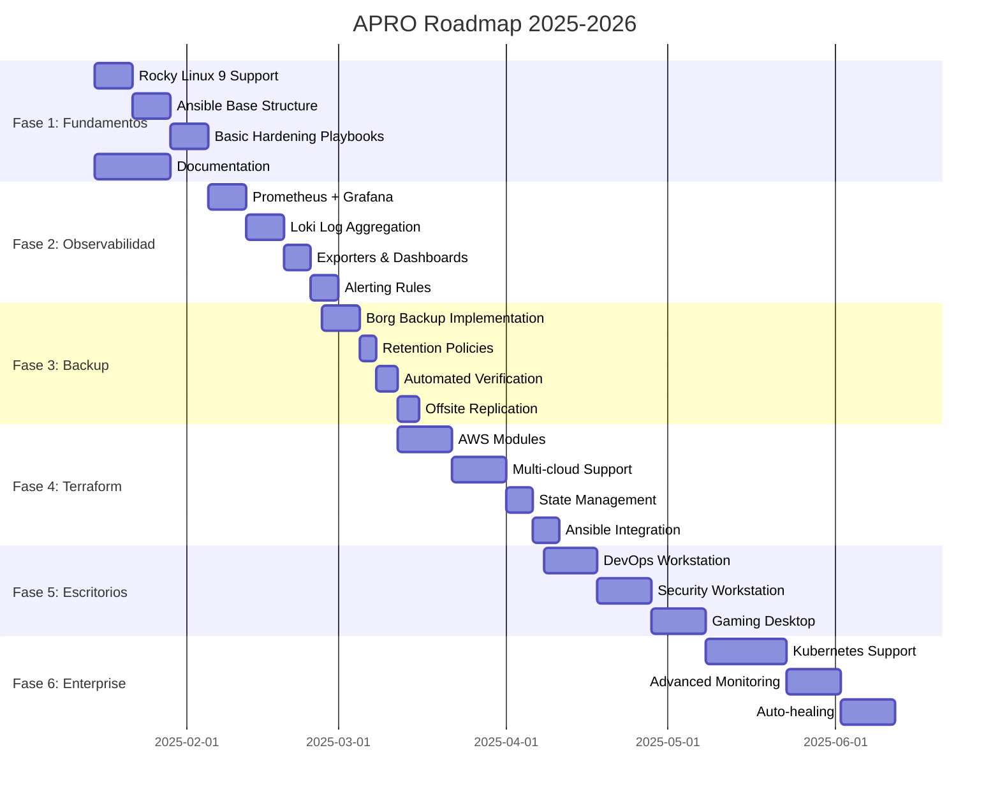

# APRO Project Roadmap

## Visión 2025-2026

Construir un sistema completo de aprovisionamiento y orquestación que cubra desde bare metal hasta cloud, desde servidores de producción hasta estaciones de trabajo especializadas, con observabilidad y seguridad de clase enterprise.

## Fases del Proyecto



---

## Sprint 1-2: Fundamentos (Semanas 1-2)

### Objetivos
- Extender soporte a Rocky Linux 9
- Crear estructura base de Ansible
- Migrar funcionalidad de provision.sh a playbooks

### Entregables

#### 1. Rocky Linux 9 Support
- [x] Script provision.sh detecta Rocky/AlmaLinux
- [ ] Funciones específicas para dnf/yum
- [ ] SELinux configuration
- [ ] Firewalld integration
- [ ] Testing en Rocky Linux 9.3

#### 2. Ansible Structure
```
ansible/
├── ansible.cfg
├── inventories/
│   ├── production/
│   │   ├── hosts.yml
│   │   └── group_vars/
│   ├── staging/
│   └── development/
├── playbooks/
│   ├── site.yml
│   ├── servers.yml
│   ├── workstations.yml
│   └── bootstrap.yml
├── roles/
│   ├── common/
│   ├── hardening/
│   ├── docker/
│   ├── monitoring/
│   └── backup/
└── group_vars/
    ├── all.yml
    ├── servers.yml
    └── workstations.yml
```

#### 3. Core Roles
- [ ] **role: common**
  - System updates
  - Essential packages
  - User management
  - SSH keys
- [ ] **role: hardening**
  - Kernel parameters
  - SSH hardening
  - Firewall rules
  - Fail2Ban
  - Audit logging
- [ ] **role: docker**
  - Docker Engine installation
  - Docker Compose
  - Registry configuration
  - Container hardening

### Métricas de Éxito
- ✅ Provision time < 15 minutos
- ✅ Idempotent playbooks (run twice = same result)
- ✅ Zero manual steps
- ✅ Documentation complete

---

## Sprint 3-4: Observabilidad (Semanas 3-4)

### Objetivos
- Implementar stack de monitoreo completo
- Centralizar logs
- Configurar alertas inteligentes

### Entregables

#### 1. Prometheus Stack
```yaml
Components:
  - Prometheus Server (metrics)
  - Node Exporter (host metrics)
  - cAdvisor (container metrics)
  - Blackbox Exporter (probes)
  - Alertmanager (alerts)

Configuration:
  - Scrape interval: 15s
  - Retention: 30 days
  - HA setup: 2+ replicas
```

#### 2. Grafana
```yaml
Dashboards:
  - Infrastructure Overview
    - CPU, RAM, Disk, Network
    - Service status
    - Alert summary

  - Host Details
    - Per-host metrics
    - Process list
    - Disk I/O

  - Container Metrics
    - Resource usage
    - Network traffic
    - Restart count

  - Application Performance
    - Request rate
    - Error rate
    - Response time
```

#### 3. Loki
```yaml
Log Sources:
  - System logs (syslog)
  - Application logs
  - Container logs
  - Audit logs

Features:
  - Label-based querying
  - Integration with Grafana
  - Retention: 90 days
  - Compression: gzip
```

#### 4. Alerting
```yaml
Alert Categories:
  - Critical (PagerDuty)
    - Service down
    - Disk > 90%
    - Memory > 95%

  - Warning (Slack)
    - High CPU
    - Backup failed
    - Certificate expiring

  - Info (Email)
    - Updates available
    - New deployment
```

### Ansible Roles
- [ ] **role: prometheus**
- [ ] **role: grafana**
- [ ] **role: loki**
- [ ] **role: alertmanager**

### Métricas de Éxito
- ✅ <5 minutes to detect outage
- ✅ <10 minutes MTTD (Mean Time To Detect)
- ✅ Zero false positives in alerts
- ✅ 100% of hosts monitored

---

## Sprint 5-6: Backup & Recovery (Semanas 5-6)

### Objetivos
- Implementar backups automatizados cifrados
- Probar recovery procedures
- Configurar replicación offsite

### Entregables

#### 1. Borg Backup
```yaml
Backup Schedule:
  Full Backup:
    - Frequency: Weekly (Sunday 2 AM)
    - Retention: 4 weeks

  Incremental:
    - Frequency: Daily (2 AM)
    - Retention: 7 days

  Monthly:
    - First Sunday of month
    - Retention: 6 months

  Yearly:
    - January 1st
    - Retention: 2 years

Configuration:
  - Encryption: AES-256
  - Compression: zstd (level 3)
  - Deduplication: Yes
  - Verification: Daily
```

#### 2. Backup Targets
```yaml
What to Backup:
  Application Data:
    - /opt/apps/
    - /var/www/

  Databases:
    - MySQL dumps
    - PostgreSQL dumps
    - Redis RDB

  Configuration:
    - /etc/ (selected files)
    - ~/.ssh/
    - /root/.ssh/

  User Data:
    - /home/ (optional)

  Docker:
    - Volumes
    - Images (optional)
```

#### 3. Offsite Replication
```yaml
Strategy:
  Primary: Local Borg repository
  Secondary: S3-compatible storage
  Tertiary: Different datacenter

Replication:
  - Method: borg sync
  - Frequency: After each backup
  - Bandwidth: Rate limited
  - Encryption: Double (Borg + S3)
```

#### 4. Recovery Testing
```yaml
Tests:
  Weekly:
    - File restore test (random files)
    - Checksum verification

  Monthly:
    - Full system restore (VM)
    - Database restore
    - Application functionality

  Quarterly:
    - Disaster recovery drill
    - Full datacenter failover
```

### Ansible Roles
- [ ] **role: borg-backup**
- [ ] **role: borg-client**
- [ ] **role: backup-verification**

### Métricas de Éxito
- ✅ RPO < 1 hour
- ✅ RTO < 30 minutes
- ✅ 100% backup success rate
- ✅ Zero data loss in tests

---

## Sprint 7-8: Terraform & IaC (Semanas 7-8)

### Objetivos
- Crear módulos Terraform reutilizables
- Integrar con Ansible
- Soportar múltiples cloud providers

### Entregables

#### 1. Terraform Structure
```
terraform/
├── modules/
│   ├── compute/
│   │   ├── aws-ec2/
│   │   ├── azure-vm/
│   │   └── gcp-instance/
│   ├── networking/
│   │   ├── vpc/
│   │   ├── security-groups/
│   │   └── load-balancer/
│   ├── storage/
│   │   ├── s3/
│   │   └── block-storage/
│   └── database/
│       ├── rds/
│       └── managed-db/
├── environments/
│   ├── dev/
│   ├── staging/
│   └── production/
└── global/
    ├── iam/
    ├── dns/
    └── monitoring/
```

#### 2. Key Modules

**Compute Module (AWS)**
```hcl
module "web_server" {
  source = "../../modules/compute/aws-ec2"

  instance_type = "t3.medium"
  ami_filter    = "debian-12-*"
  key_name      = "apro-production"

  vpc_id            = module.network.vpc_id
  subnet_id         = module.network.private_subnet_id
  security_group_id = module.network.web_sg_id

  user_data = templatefile("${path.module}/user_data.sh", {
    ansible_pull_url = var.ansible_repo
    environment      = "production"
  })

  tags = {
    Environment = "production"
    ManagedBy   = "terraform"
    Project     = "apro"
  }
}
```

#### 3. State Management
```yaml
Backend Configuration:
  - Type: S3 + DynamoDB (AWS)
  - Encryption: AES-256
  - Versioning: Enabled
  - Locking: DynamoDB table

Workspaces:
  - dev
  - staging
  - production

Access Control:
  - IAM roles per environment
  - MFA required for production
  - Audit logging enabled
```

#### 4. Integration with Ansible
```yaml
Workflow:
  1. Terraform provisions infrastructure
  2. Output inventory data
  3. Trigger Ansible via provisioner
  4. Ansible configures instances
  5. Smoke tests
  6. Update monitoring

Example:
  - Terraform creates EC2 instances
  - Outputs private IPs
  - Generates dynamic inventory
  - Ansible playbook runs automatically
  - Prometheus scrape config updated
```

### Métricas de Éxito
- ✅ Infrastructure provisioning < 10 minutes
- ✅ Zero manual configuration
- ✅ Drift detection automated
- ✅ Multi-cloud parity

---

## Sprint 9-10: DevOps Workstation (Semanas 9-10)

### Objetivos
- Crear playbook para estación de trabajo DevOps
- Automatizar instalación de herramientas
- Dotfiles management

### Entregables

#### 1. Base System
```yaml
Distribution: Arch Linux
Desktop Environment:
  - GNOME (default)
  - KDE Plasma (alternative)
  - i3wm (tiling)

Essential Packages:
  - base-devel
  - git
  - linux-headers
  - yay (AUR helper)
```

#### 2. Development Tools
```yaml
Containers:
  - docker
  - docker-compose
  - kubectl
  - k9s
  - helm

Infrastructure:
  - terraform
  - ansible
  - packer
  - vagrant

Cloud CLIs:
  - aws-cli
  - google-cloud-sdk
  - azure-cli

IDEs:
  - Visual Studio Code
  - JetBrains Toolbox
    - IntelliJ IDEA
    - PyCharm
    - GoLand

Terminal:
  - tmux
  - zsh + oh-my-zsh
  - fzf
  - ripgrep
  - bat
  - exa
  - fd

Version Control:
  - git
  - github-cli
  - gitlab-cli
  - lazygit
```

#### 3. Monitoring & Debugging
```yaml
Tools:
  - htop/btop
  - iotop
  - nethogs
  - ncdu
  - wireshark
  - tcpdump
  - nmap
  - curl/httpie
  - jq/yq
```

#### 4. Dotfiles
```yaml
Managed via:
  - GNU Stow
  - Git repository

Includes:
  - .zshrc
  - .tmux.conf
  - .vimrc
  - .gitconfig
  - VSCode settings
  - i3 config
```

### Ansible Playbook
```yaml
- name: DevOps Workstation Setup
  hosts: localhost
  tasks:
    - import_role:
        name: arch-base
    - import_role:
        name: desktop-environment
    - import_role:
        name: development-tools
    - import_role:
        name: dotfiles
```

---

## Sprint 11-12: Security Workstation (Semanas 11-12)

### Objetivos
- Crear estación de trabajo para pentesting
- Integrar herramientas de Kali
- Configurar labs virtuales

### Entregables

#### 1. Base System
```yaml
Distribution: Arch Linux + Kali Repos
Desktop: GNOME / Xfce
Kernel: Hardened with security patches
```

#### 2. Security Tools
```yaml
Web Application:
  - Burp Suite Professional
  - OWASP ZAP
  - Nikto
  - SQLMap
  - WPScan

Network:
  - Nmap
  - Masscan
  - Wireshark
  - Netcat
  - Scapy

Exploitation:
  - Metasploit Framework
  - Empire
  - Covenant
  - Social Engineer Toolkit

Password:
  - Hashcat
  - John the Ripper
  - Hydra
  - CeWL

Reverse Engineering:
  - Ghidra
  - radare2
  - IDA Free
  - Binary Ninja (demo)

Forensics:
  - Autopsy
  - Volatility
  - Sleuth Kit

Wireless:
  - Aircrack-ng suite
  - Kismet
  - Wifite

Reporting:
  - CherryTree
  - Obsidian
  - Dradis
```

#### 3. Virtual Labs
```yaml
VM Management:
  - VirtualBox
  - Vagrant
  - Docker

Lab VMs:
  - Metasploitable2/3
  - DVWA
  - WebGoat
  - HackTheBox VMs
```

---

## Sprint 13-14: Gaming Desktop (Semanas 13-14)

### Objetivos
- Configurar gaming desktop basado en Arch
- Optimizar performance
- Integrar launchers

### Entregables

#### 1. Base System
```yaml
Distribution:
  Option 1: SteamOS (Valve official)
  Option 2: ChimeraOS (SteamOS-like)
  Option 3: Arch + Custom config

Desktop: KDE Plasma
Kernel: linux-zen (optimized for gaming)
```

#### 2. Gaming Components
```yaml
Drivers:
  - Mesa (AMD)
  - NVIDIA proprietary (NVIDIA)
  - Vulkan support

Gaming Tools:
  - Steam
  - Proton (latest)
  - Proton-GE
  - Lutris
  - Wine-staging
  - PlayOnLinux
  - GameMode
  - MangoHud (FPS overlay)

Launchers:
  - Steam
  - Heroic Games Launcher (Epic/GOG)
  - Bottles (Wine manager)

Streaming:
  - Moonlight (NVIDIA GameStream)
  - Sunshine (self-hosted)
  - OBS Studio
```

#### 3. Performance Tuning
```yaml
Kernel Parameters:
  - CPU governor: performance
  - I/O scheduler: mq-deadline
  - Disable mitigations (optional)

System:
  - GameMode auto-activation
  - Process priority management
  - RAM optimization

Graphics:
  - FreeSync/G-Sync
  - Compositor disable on fullscreen
  - Shader cache optimization
```

---

## Sprint 15+: Evolución Continua

### Kubernetes
- [ ] K3s for edge
- [ ] Full K8s for production
- [ ] Helm charts
- [ ] Operators

### Advanced Monitoring
- [ ] Distributed tracing (Tempo/Jaeger)
- [ ] APM (Application Performance Monitoring)
- [ ] Real User Monitoring
- [ ] AI-powered anomaly detection

### Security Enhancements
- [ ] SIEM integration
- [ ] Threat intelligence feeds
- [ ] Automated incident response
- [ ] Compliance automation (SOC2, ISO27001)

### Multi-Cloud
- [ ] Cloud-agnostic abstractions
- [ ] Multi-cloud cost optimization
- [ ] Disaster recovery across clouds

---

## Métricas Clave del Proyecto

### Técnicas
| Métrica | Target | Actual |
|---------|--------|--------|
| Deployment Time | <15 min | TBD |
| MTTR | <30 min | TBD |
| Test Coverage | >80% | TBD |
| Documentation | 100% | 60% |

### Operacionales
| Métrica | Target | Actual |
|---------|--------|--------|
| Uptime | 99.9% | TBD |
| RTO | <30 min | TBD |
| RPO | <1 hour | TBD |
| Backup Success | 100% | TBD |

### Seguridad
| Métrica | Target | Actual |
|---------|--------|--------|
| Vulnerabilities | 0 High+ | TBD |
| Compliance Score | >90% | TBD |
| Incident Response | <15 min | TBD |
| Patch Time | <24 hours | TBD |

---

## Riesgos y Mitigaciones

| Riesgo | Probabilidad | Impacto | Mitigación |
|--------|--------------|---------|------------|
| Scope creep | Alta | Alto | Sprint planning estricto, MVP first |
| Tool compatibility | Media | Medio | Testing temprano, alternatives ready |
| Cloud costs | Media | Alto | Cost monitoring, budgets, alerts |
| Team bandwidth | Alta | Alto | Priorización, automatización |
| Security gaps | Baja | Crítico | Security-first design, audits |

---

## Hitos Clave

### Q1 2025
- ✅ Proyecto iniciado
- [ ] Rocky Linux 9 support
- [ ] Ansible foundation
- [ ] Monitoring stack

### Q2 2025
- [ ] Backup automation
- [ ] Terraform modules
- [ ] DevOps workstation

### Q3 2025
- [ ] Security workstation
- [ ] Gaming desktop
- [ ] CI/CD integration

### Q4 2025
- [ ] Kubernetes support
- [ ] Advanced monitoring
- [ ] Multi-cloud

### 2026
- [ ] Auto-healing
- [ ] AI/ML integration
- [ ] Enterprise features
- [ ] Community edition

---

**Versión**: 1.0.0
**Última Actualización**: 2025-01-15
**Autor**: Juan Damian Pajares

**Nota**: Este roadmap es un documento vivo y se actualizará según las prioridades del proyecto y feedback de la comunidad.
